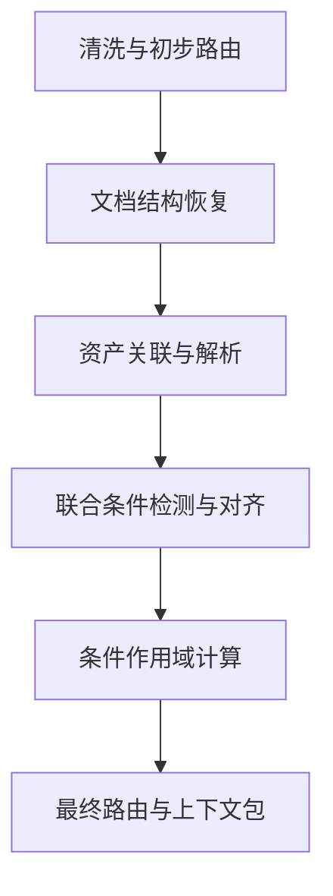

# Constella上下文构建模块编程任务书

## 1. 任务名称

**Constella Context Builder：工业文档可追溯上下文构建**

所属项目：

```text
Constella
```

当前实现模块：

```text
context_builder
```

本任务只负责：

```text
MinerU文档结构结果
→ 文档结构恢复
→ 正文与资产关联
→ 条件及作用域计算
→ 小而完整的上下文包
```

后续知识抽取、本体构建、Neo4j存储、图谱推理和工艺参数推荐不属于本任务。

## 2. 任务目标

将MinerU生成的标题、正文、图片、表格和公式等结构块组织为统一的 `DocumentGraph`，恢复章节结构和阅读关系，建立正文与资产及其子结构的联系，识别条件的来源和作用范围，最终为后续规则抽取生成可追溯的 `ContextPackage`。

上下文包必须满足：

- 包含产生当前规则所必需的完整正文；
- 包含相关标题、图表、公式和解释信息；
- 包含真正覆盖当前规则的条件；
- 不混入其他表格行、曲线、区域或试验工况；
- 所有内容均能追溯到MinerU原始块和原PDF位置；
- 不通过模型补充原文未表达的事实。

## 3. 输入与输出边界

### 3.1 输入

输入为已有MinerU预处理结果，至少可能包含：

```text
title
passage
figure
table
formula
caption
page
bbox
original_block_id
asset_path
```

实现前必须检查现有GMAWGraph仓库中的真实字段和目录。字段名称不一致时建立输入适配层，不得直接假设任务书中的示例字段就是实际字段。

不得重新执行：

- PDF OCR；
- MinerU版面分析；
- 固定长度token切块。

### 3.2 输出

正式输出只保留：

```text
document_graph.json
context_packages.jsonl
ontology_candidates.jsonl
ambiguities.jsonl
run_report.json
```

其中：

- `document_graph.json`：统一文档图；
- `context_packages.jsonl`：后续规则抽取输入；
- `ontology_candidates.jsonl`：定义、分类、组成等候选；
- `ambiguities.jsonl`：无法唯一解决的资产、条件和指代；
- `run_report.json`：数量、耗时、模型调用和异常统计。

## 4. 核心处理原则

1. 不以固定token长度切分完整语义段落。
2. 先恢复章节和阅读结构，再处理语义条件。
3. 先确定正文关联哪个资产，再解析资产内部结构。
4. 先联合发现正文条件和资产条件，再进行精确子结构对齐。
5. 资产条件只有对齐成功后，才能进入当前规则上下文。
6. 条件来源与条件作用范围分别保存。
7. 不确定结果不得伪装成确定结果。
8. 非规则内容不删除，只进行分流。
9. 本阶段只组织证据，不抽取最终知识三元组。
10. 所有关键判断必须保留规则ID、Prompt版本或证据关系。

## 5. 数据结构设计

公共数据结构集中在 `models` 包中管理，但不全部堆入单个 `schema.py`。

```text
models/
├── document.py
├── context.py
├── config.py
└── __init__.py
```

业务模块只能从 `models/__init__.py` 引用公共类型，不得创建平行Schema。

### 5.1 SourceRef

```python
SourceRef:
    page: int | None
    bbox: list[float] | None
    original_block_id: str | None
    asset_path: str | None
```

用于定位MinerU原始块和PDF位置。

### 5.2 Unit

```python
Unit:
    id: str
    type: str
    content: str | dict | list | None
    source: SourceRef
    role: list[str]
    attributes: dict
```

`type`至少支持：

```text
title
passage
figure
table
formula
caption
table_row
table_column
table_cell
figure_curve
figure_region
figure_axis
formula_variable
```

`role`支持多标签：

```text
rule
ontology
support
noise
```

初步路由结果不直接覆盖最终角色，应暂存在：

```python
Unit.attributes["route_candidates"]
```

格式规则命中记录保存在：

```python
Unit.attributes["matched_pattern_ids"]
```

### 5.3 Relation

```python
Relation:
    id: str
    source_id: str
    target_id: str
    type: str
    confidence: float | None
    evidence: list[str]
    attributes: dict
```

主要关系：

```text
NEXT
IN_SECTION
CONTINUES
CONTAINS
MENTIONS
INTRODUCES
EXPLAINS
ALIGNS_WITH
```

`evidence`保存支持该关系的Unit ID、规则ID或模型判断记录，不保存无来源的自然语言结论。

### 5.4 Constraint

```python
Constraint:
    id: str
    type: str
    value: object
    source_id: str
    scope: dict
    status: str
    attributes: dict
```

`status`：

```text
certain
uncertain
conflict
```

`source_id`表示条件从哪个标题、正文、表格行、图例、曲线或公式说明中得到。

`scope`直接保存作用范围，不再维护额外的条件快照。例如：

```json
{
  "scope_type": "unit_range",
  "start_unit_id": "passage_201",
  "end_unit_id": "passage_208",
  "target_unit_ids": [],
  "candidate_ranges": []
}
```

资产局部条件可以表示为：

```json
{
  "scope_type": "asset_parts",
  "start_unit_id": null,
  "end_unit_id": null,
  "target_unit_ids": ["table_5_3_row_05"],
  "candidate_ranges": []
}
```

无法确定唯一范围时：

```json
{
  "scope_type": "uncertain",
  "candidate_ranges": [
    ["passage_201", "passage_205"],
    ["passage_201", "passage_208"]
  ]
}
```

此时 `status` 必须为 `uncertain`，不得作为确定条件进入规则包。

### 5.5 Ambiguity

```python
Ambiguity:
    id: str
    type: str
    source_unit_ids: list[str]
    candidate_ids: list[str]
    reason: str
    status: str
```

用于保存：

- 正文可能关联多个资产；
- 曲线编号无法对应具体曲线；
- 条件来源或终止位置不明确；
- 指代无法唯一解析；
- 模型调用失败或返回格式错误。

### 5.6 DocumentGraph

```python
DocumentGraph:
    units: dict[str, Unit]
    relations: list[Relation]
    constraints: dict[str, Constraint]
    ambiguities: dict[str, Ambiguity]
    metadata: dict
```

### 5.7 ContextPackage

```python
ContextPackage:
    id: str
    core_unit_ids: list[str]
    support_unit_ids: list[str]
    constraint_ids: list[str]
    asset_part_ids: list[str]
    unresolved_ids: list[str]
    attributes: dict
```

上下文包引用 `DocumentGraph` 中的ID，不复制整章原文。

一个上下文包对应：

> 一组共享主要条件、关联同一结论对象、可以独立交给下游模型抽取的规则组。

如果同一段落包含多个工况或分别解释多条曲线，必须拆成多个规则组，而不是按自然段强制生成一个包。

## 6. 六个主模块及执行顺序

```text
1. 文档清洗与初步路由
2. 文档结构恢复
3. 资产关联与资产解析
4. 正文—资产联合条件检测与对齐
5. 条件作用域计算
6. 最终路由与上下文包生成
```



## 7. 模块一：文档清洗与初步路由

主要入口：

```python
def normalize_document(
    graph: DocumentGraph,
    runtime: PipelineRuntime,
) -> None:
    ...
```

具体步骤：

1. 将MinerU块转换为统一 `Unit`；
2. 按页码和bbox恢复页内顺序；
3. 识别页眉、页脚、页码和重复块；
4. 只有确定噪声标记为 `noise`；
5. 合并段内OCR断行；
6. 检测跨页未结束句并建立 `CONTINUES`；
7. 通过结构类型和文本格式生成初步路由候选；
8. 仅将低置信度单元批量交给小模型辅助分类。

初步阶段不得最终决定：

- 见图类段落是否为规则；
- 资产解释段是否属于当前规则；
- 图表中的条件是否覆盖正文。

输出写入：

```text
graph.units
graph.relations
Unit.attributes.route_candidates
Unit.attributes.matched_pattern_ids
```

## 8. 模块二：文档结构恢复

主要入口：

```python
def build_document_structure(
    graph: DocumentGraph,
    runtime: PipelineRuntime,
) -> None:
    ...
```

具体步骤：

1. 根据“第5章”“5.2”“5.2.3”等编号识别标题等级；
2. 结合目录、版式和相邻编号修正候选等级；
3. 建立章节树；
4. 将正文和资产挂载到对应章节；
5. 建立全文 `NEXT` 阅读顺序；
6. 保留跨页 `CONTINUES`；
7. 为所有单元保存章节路径。

低置信度标题不得直接终止上一章节条件，应记录到 `Ambiguity`，由后续作用域计算处理。

## 9. 模块三：资产关联与资产解析

主要入口：

```python
def build_asset_structure(
    graph: DocumentGraph,
    runtime: PipelineRuntime,
) -> None:
    ...
```

### 9.1 正文—资产粗关联

关联优先级：

```text
明确图表编号
> 图题或表题
> “上图、下表”等相对指代
> 页内空间位置
> 当前章节中的激活资产
```

建立：

```text
MENTIONS
INTRODUCES
EXPLAINS
```

存在多个候选时，不得直接选择距离最近者，必须保存候选及判断依据。

### 9.2 资产内部解析

将资产拆为可定位的子单元：

```text
表格 → 表头、行、列、单元格
曲线图 → 坐标轴、图例、曲线、区域、标注点
公式 → 表达式、变量、常量、输入、输出、变量说明
```

建立：

```text
资产 CONTAINS 资产子单元
```

资产无法可靠拆分时：

- 保留整个资产Unit；
- 保存已有OCR和题注；
- 创建未解析记录；
- 不虚构曲线、区域或变量。

本模块只完成“候选关联”和“资产结构化”，不决定正文究竟使用哪一行或哪条曲线。

## 10. 模块四：联合条件检测与资产子结构对齐

主要入口：

```python
def detect_and_align_conditions(
    graph: DocumentGraph,
    runtime: PipelineRuntime,
) -> None:
    ...
```

### 10.1 联合条件检测

扫描：

- 章节标题；
- 小节标题；
- 正文；
- 图题、表题；
- 表头、行、列和单元格；
- 坐标轴、图例、曲线和区域；
- 公式及变量说明。

条件类型至少包括：

```text
焊接方法
材料
保护气体
焊丝类型与直径
过渡形式
焊接位置
接头形式
参数及参数值
试验对象
试验条件
控制条件
```

此时产生的是条件候选，并保存准确来源Unit。

### 10.2 正文—资产子结构对齐

利用正文表达、资产候选关系和双方条件进行对齐：

```text
“0.5g铁锈”
→ table_5_3_row_05

“曲线3”
→ figure_5_18_curve_03

“区域Ⅱ”
→ figure_5_14_region_02
```

对齐成功后建立：

```text
正文 ALIGNS_WITH 资产子单元
```

禁止：

- 正文只提到0.5g时绑定整张表；
- 正文只解释曲线3时加入全部曲线；
- 一个区域的条件扩散到其他区域；
- 因位置邻近而绕过明确编号；
- 在多个候选无法区分时强制选择。

只有成功对齐的资产子结构条件，才有资格进入当前正文的条件候选集合。

## 11. 模块五：条件作用域计算

主要入口：

```python
def resolve_constraint_scopes(
    graph: DocumentGraph,
    runtime: PipelineRuntime,
) -> None:
    ...
```

按文档顺序维护以下层级：

```text
chapter
section
topic_or_experiment
asset_group
statement_group
```

作用域开始位置由条件来源和结构位置确定。

作用域结束规则依次为：

1. 出现同类型的新条件并明确覆盖旧条件；
2. 进入同级或更高级标题；
3. 明确切换到新材料、新工艺或新试验；
4. 当前资产解释组结束；
5. 当前并列规则组或句内条件结束。

例如：

```text
“第5章 CO₂气体保护焊”
→ 章节条件

“在其他条件相同时”
→ 当前规则组条件

“表5-3中铁锈量为0.5g”
→ 对应表格行及其解释结论
```

正文和资产表达同一条件时，可以合并证据，但不得丢失各自来源。

条件冲突时：

- 两条条件均保留；
- `status = conflict`；
- 记录冲突来源；
- 不自动选择其中一条作为确定条件。

无法确定结束位置时：

- 保存候选范围；
- `status = uncertain`；
- 不作为确定条件加入上下文包。

## 12. 模块六：最终路由与上下文包生成

主要入口：

```python
def finalize_routes_and_build_packages(
    graph: DocumentGraph,
    runtime: PipelineRuntime,
) -> list[ContextPackage]:
    ...
```

### 12.1 最终路由

综合以下信息修正初步路由：

- 文本格式；
- 章节位置；
- 正文—资产关系；
- 已对齐资产子单元；
- 条件及作用范围；
- 相邻解释段。

例如：

```text
“其变化规律如图5-18所示”
```

初步可能只是：

```text
support
```

如果该段与图5-18中的指定曲线及其输入—输出解释形成完整规则，可以更新为：

```text
rule + support
```

定义、分类、组成、上下级和型号信息进入：

```text
ontology
```

最终仍不产生规则三元组，只确定内容进入哪个下游通道。

### 12.2 规则组识别

上下文包不机械按单个段落生成。

应先识别规则组：

- 共享相同主要条件；
- 描述同一个作用对象或结果；
- 使用同一个资产或同一组资产子结构；
- 可以在不读取整章的情况下独立解释。

以下情况必须拆包：

- 同一段落包含不同材料；
- 同一段落分别解释多条曲线；
- 不同表格行对应不同工况；
- 条件在段落内部发生切换；
- 并列结论的条件并不相同。

### 12.3 上下文包组成

```text
core_unit_ids
```

保存直接产生当前规则的完整正文及必要续接段。

```text
support_unit_ids
```

保存标题、题注、表头、图例、公式说明及必要相邻解释。

```text
constraint_ids
```

只保存作用范围覆盖当前规则组且状态为 `certain` 的条件。

```text
asset_part_ids
```

只保存与当前规则组成功对齐的行、列、曲线、区域或公式变量。

```text
unresolved_ids
```

保存与当前规则相关但尚未解决的问题。

不得因为存在 `unresolved_ids` 就静默删除整个上下文包；应由下游根据问题类型决定是否抽取。

## 13. 文本格式管理

文本格式集中保存在：

```text
configs/patterns.yaml
```

至少包含：

```text
noise
heading
asset_reference
continuation
rule_language
ontology_language
condition_language
```

每条格式包含：

```yaml
id:
enabled:
priority:
match:
pattern:
handler:
action:
```

其中 `pattern` 和 `handler` 根据匹配类型二选一。

统一入口：

```python
class PatternEngine:
    def match(self, group: str, text: str) -> list:
        ...

    def explain(self, text: str) -> list:
        ...

    def validate(self) -> list[str]:
        ...
```

业务模块不得散落大量正则表达式。复杂算法可以写在代码中，但其启用状态、规则ID和优先级必须通过配置管理。

检查脚本支持：

```bash
python scripts/inspect_patterns.py list --group heading
python scripts/inspect_patterns.py test --text "在其他条件相同时"
python scripts/inspect_patterns.py validate
```
具体文本格式管理规范见文件pattern_file.md。

## 14. 大语言模型调用

模型主要为本地模型，统一通过OpenAI兼容接口调用。

不实现：

- 显存调度；
- 模型自动部署；
- 多级降级；
- 复杂密钥中心；
- 通用Prompt管理平台。

模型配置只保留主要调用参数：

```yaml
models:
  small:
    base_url: http://127.0.0.1:8000/v1
    api_key: local
    model: local-small-model
    temperature: 0
    max_tokens: 1024
    timeout: 120

  large:
    base_url: http://127.0.0.1:8001/v1
    api_key: local
    model: local-large-model
    temperature: 0
    max_tokens: 4096
    timeout: 300
```

统一调用入口：

```python
class LLMClient:
    def complete(
        self,
        model_key: str,
        messages: list[dict],
        response_format: dict | None = None,
        **overrides,
    ) -> dict:
        ...
```

主要用途：

- 小模型：低置信度内容路由；
- 大模型：规则无法解决的资产解释和候选歧义判断。

模型只能：

- 在给定候选中选择；
- 返回 `unknown`；
- 对给定内容进行结构化分类或解释。

模型不得：

- 创建不存在的资产ID；
- 补充原文没有的条件；
- 将不确定结果直接标记为 `certain`；
- 脱离候选范围关联图表；
- 直接生成本阶段之外的知识图谱。

## 15. Prompt管理

Prompt集中保存在：

```text
prompts/
```

首轮只实现：

```text
route_classifier_v1.yaml
ambiguity_resolver_v1.yaml
asset_interpreter_v1.yaml
```

每个Prompt至少包含：

```text
id
version
system
input_template
output_schema
examples
```

修改Prompt行为时增加版本号，不得覆盖旧内容后仍保留原版本号。

模型调用记录至少保存：

```text
task
model
prompt_id
prompt_version
input_unit_ids
status
latency
```

不要求保存完整输入和输出，但必须能够追溯到相关Unit。

## 16. 文件结构

```text
Constella/
├── src/constella/context_builder/
│   ├── models/
│   │   ├── __init__.py
│   │   ├── document.py
│   │   ├── context.py
│   │   └── config.py
│   ├── pipeline.py
│   ├── cleaning.py
│   ├── structure.py
│   ├── assets.py
│   ├── conditions.py
│   ├── scopes.py
│   ├── routing.py
│   ├── packages.py
│   ├── pattern_engine.py
│   ├── llm_client.py
│   └── io.py
├── configs/context_builder/
│   ├── pipeline.yaml
│   ├── patterns.yaml
│   └── models.yaml
├── prompts/context_builder/
├── scripts/
│   ├── build_context_packages.py
│   └── inspect_patterns.py
├── tests/context_builder/
└── outputs/context_builder/
```

这是职责结构，不要求机械覆盖现有仓库。实现前应先映射到GMAWGraph当前目录，优先复用已有代码和数据结构。

## 17. 总程序入口

```python
def run_context_builder(
    input_path: str,
    output_dir: str,
    runtime: PipelineRuntime,
) -> DocumentGraph:
    graph = load_mineru_document(input_path)

    normalize_document(graph, runtime)
    build_document_structure(graph, runtime)
    build_asset_structure(graph, runtime)
    detect_and_align_conditions(graph, runtime)
    resolve_constraint_scopes(graph, runtime)
    packages = finalize_routes_and_build_packages(graph, runtime)

    save_context_outputs(graph, packages, output_dir)
    return graph
```

各阶段只能调用本阶段内部辅助函数，不得暗中调用后续阶段。

## 18. Luna与Terra执行方式

模型分工用于降低实现时间，不建立额外的权限体系。

### Terra

负责需要全局理解和跨模块一致性的工作：

- 检查现有仓库及MinerU真实结构；
- 建立公共数据结构；
- 实现总体流程；
- 实现资产子结构对齐；
- 实现条件作用域；
- 完成真实案例集成验证。

### Luna

负责边界清晰、可独立测试的工作：

- 文本格式配置及规则引擎；
- 输入适配与输出序列化；
- OpenAI兼容模型客户端；
- Prompt加载；
- 独立单元测试和检查脚本。

使用多个Codex执行时，应按实际文件避免同时修改同一文件，但不设置“最终修改权”等额外组织规则。公共结构发生改变时，由主任务统一同步相关模块。

## 19. 验收案例

### 19.1 表5-3

期望：

- 正文与表5-3建立资产关系；
- “0.5g”和“1g”分别对齐到对应表格行；
- 两行条件分别进入对应规则包。

禁止：

- 将整张表的全部行加入同一规则；
- 0.5g正文继承1g行的条件。

### 19.2 图5-14

期望：

- 跨页正文通过 `CONTINUES` 保持连续；
- 区域Ⅰ、Ⅱ、Ⅲ分别建立子单元；
- 每段解释只对齐相应区域。

禁止：

- 因跨页而丢失章节条件；
- 将三个区域的条件合并成一个确定条件。

### 19.3 图5-18

期望：

- 四条曲线分别建立子单元；
- 曲线说明和工况分别对齐；
- 不同曲线生成独立规则组或独立上下文包。

禁止：

- 将四条曲线的气瓶处理条件混合；
- 只因共用一张图就共享全部条件。

### 19.4 式5-21

期望：

- 公式表达式、输入、输出和变量说明可关联；
- 正文与实际使用的公式或变量建立 `ALIGNS_WITH`；
- 未在正文中使用的变量不自动进入核心条件。

### 19.5 图5-20

期望：

- 分类关系进入本体候选；
- 图题和分类节点得到保留；
- 不生成规则上下文包。

### 19.6 表5-1

期望：

- 教材明确表达的结论可以保留；
- 缺少的控制条件标记为未解决；
- 不自行补全“其他条件”。

### 19.7 表5-17

期望：

- 符号含义不完整时保存原始资产和歧义；
- 不生成确定规则；
- 不利用模型猜测缺失符号。

## 20. 验收标准

1. 一个命令能从实际MinerU结果生成全部正式输出。
2. 所有单元均可追溯到原始块、页码和bbox。
3. 正文—资产关联与正文—资产子结构对齐可以区分。
4. 条件来源与条件作用范围分别保存。
5. 表格条件不跨行，曲线条件不跨曲线。
6. 不确定条件不作为确定条件进入上下文包。
7. 同一段落中的不同工况能够拆成不同规则组。
8. 非规则内容未被删除，并能进入本体或支撑通道。
9. 格式判断可追溯到规则ID。
10. 模型判断可追溯到模型和Prompt版本。
11. 七个真实案例都有自动化测试或可重复检查结果。
12. 从MinerU结果到上下文包的运行时间不超过10分钟。

10分钟范围不包括：

- MinerU OCR；
- 下游规则抽取；
- 本体抽取；
- Neo4j导入；
- 参数推荐。

## 21. 明确不实现的内容

本任务不实现：

- 规则三元组抽取；
- 本体知识抽取；
- 知识图谱融合；
- Neo4j导入；
- 多跳推理；
- 工艺参数推荐；
- 模型部署与显存调度；
- 对缺失条件的常识补全；
- 对模糊图表的强制结构化。

## 22. 停止和报告条件

出现以下情况时停止扩展并报告，不得自行改变主线：

- MinerU实际输出无法提供任务所需的资产或定位信息；
- 曲线和区域必须依赖新的视觉识别能力才能区分；
- 条件范围存在系统性歧义；
- 公共数据结构需要发生较大变化；
- 真实案例与任务书中的案例描述不一致；
- 10分钟目标明显受到模型调用量限制。

报告必须说明：

```text
问题发生在哪个阶段
涉及哪些Unit或资产
已有证据
不能继续的原因
建议修改的最小范围
```

这版的核心链路已经统一为：

> **资产粗关联与解析 → 正文和资产联合发现条件 → 精确对齐资产子结构 → 计算条件作用域 → 按规则组生成上下文包。**

这才是当前“上下文构建”任务的真正主线。