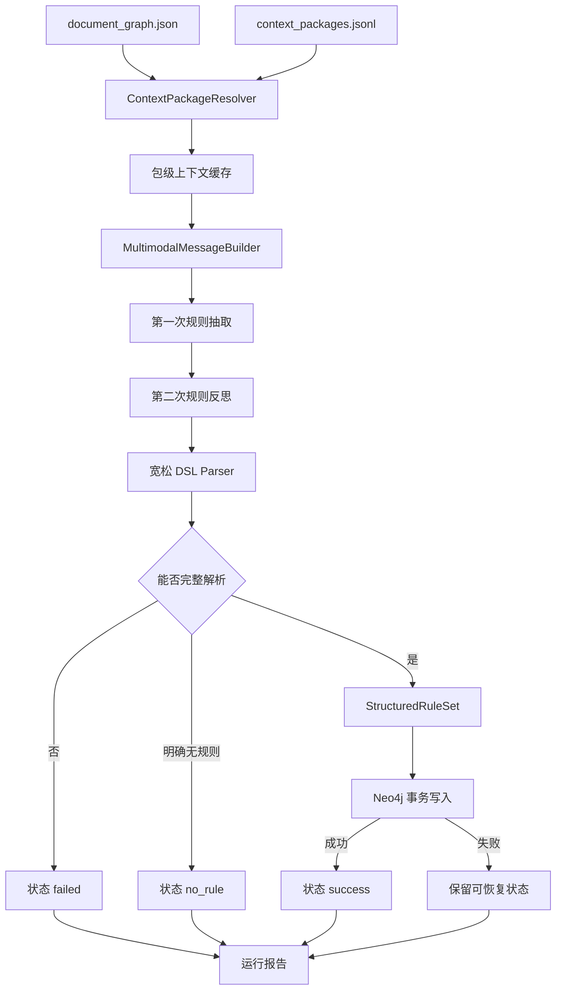

# Constella 规则抽取模块 Coding Plan

## 1. 任务名称

**Constella Rule Extraction：多模态工业规则抽取、结构化与 Neo4j 存储**

本任务在现有 `context_builder` 之后实现独立的 `rule_extraction` 模块，完成：

```text
document_graph.json + context_packages.jsonl
→ 按包组装完整多模态上下文
→ Qwen3.5-9B 规则初次抽取
→ Qwen3.5-9B 对照原文反思
→ 宽松 DSL 解析
→ 结构化规则集合
→ Neo4j 规则图
→ 上下文包处理状态与运行报告
```

设计依据为：

- `rule_extraction_design.md`；
- 当前项目实际 `ContextPackage`、`DocumentGraph`、LLM 客户端和输出格式；
- 当前真实 GMAW Context Builder 结果；
- 本任务中已经确认的实现决策。

---

## 2. 已确认且不得自行改变的决策

### 2.1 输入与组装

采用方案 D：保留现有引用型输入，规则抽取模块按上下文包解析并缓存完整输入。

```text
outputs/context_builder/document_graph.json
+ outputs/context_builder/context_packages.jsonl
→ ContextPackageResolver
→ 包级完整上下文缓存
```

不得要求 Context Builder 改为自包含 ContextPackage，也不得在规则抽取时覆盖 Context Builder 的原始输出。

### 2.2 模型与图片

- 使用支持图片输入的本地 Qwen3.5-9B；
- 通过 OpenAI-compatible API 调用；
- 关联图片作为上下文直接传入模型；
- 图片处理必须有专项适配层；
- 暂不规定图片尺寸上限，不主动缩放、裁剪或切图；
- 如果真实运行出现上下文长度、显存、模型图片数量或分辨率问题，停止扩展并报告真实包、图片和错误，再决定尺寸策略；
- 同一张图片被多个 ContextPackage 引用时允许重复读取和处理，不实现跨包图片去重。

### 2.3 最终表达和校验

- 保留设计文档中的 `C/R` DSL；
- 第一版不建立严格封闭语法，不限制关系词集合，不因多余空白、换行、Markdown 包裹或编号样式差异直接拒绝；
- 校验只负责判断反思后的最终结果能否解析成完整结构化规则；
- 不实现事实正确性检查、原文蕴含验证、重复规则检查、逻辑冲突检查、跨包冲突检查或自动修复；
- 解析失败时当前 ContextPackage 整体失败，不产生正式规则，也不写入 Neo4j；
- 规则初稿仅用于第二轮反思，不作为正式输出。

### 2.4 图存储

- 正式图存储后端为本地 Neo4j；
- Neo4j 根目录为 `/DATA/jm/neo4j/CollestaGraph`；
- Bolt 地址依据现有配置使用 `bolt://127.0.0.1:7200`；
- HTTP 地址为 `http://127.0.0.1:7201`，业务代码不依赖 HTTP 接口；
- 用户名为 `neo4j`；
- 密码必须通过环境变量或仅限本机且不纳入版本控制的运行配置提供，不得写进代码、仓库配置、测试快照或日志；
- 程序假设 Neo4j 服务已启动，只执行连接预检，不负责自动启动、停止或重启服务；
- 新抽取任务第一次运行时删除 Neo4j 原有图数据；
- 同一任务断点恢复时不得再次删除图数据；
- 提供显式 `--reset-graph` 开始新的全量任务。

### 2.5 去重

- 图节点仅在节点类型及所有参与身份判断的字段完全一致时去重；
- 不做同义词、单位等价、大小写、中文符号、语义或本体级合并；
- 状态规范文本只用于保存和检索，不据此把原始表达不同的状态节点合并；
- 同一图片允许在不同包中重复处理。

### 2.6 状态和恢复

- 必须使用持久化状态文件支持断点恢复；
- 默认使用 SQLite，保证逐包状态、模型调用和图提交记录的原子更新；
- 已成功或明确无规则的包在恢复时跳过；
- 中断在模型调用或解析阶段的包重新从该包第一轮模型调用开始；
- 中断在图写入阶段的包先核对 Neo4j 提交标记，再决定跳过或重写；
- 上下文包是模型处理和 Neo4j 事务的基本边界。

---

## 3. 现有项目事实与实现边界

### 3.1 当前输入不是自包含对象

现有 `ContextPackage` 字段为：

```text
id
core_unit_ids
support_unit_ids
constraint_ids
asset_part_ids
unresolved_ids
attributes
```

正文、标题、表格、公式、图片路径和来源信息位于 `document_graph.json`。规则抽取必须通过 ID 解析，不得假设 `context_packages.jsonl` 已复制这些内容。

### 3.2 当前资产粒度

当前 Context Builder 保留完整的：

```text
figure
table
formula
```

尚未生成表格行、曲线、区域、坐标轴或公式变量等资产子 Unit。规则抽取第一版必须接受这一事实，不得虚构子结构 ID，也不得把图中视觉识别到的曲线或区域回写成 Context Builder Unit。

### 3.3 当前真实数据基线

以 `outputs/context_builder` 当前结果为首个正式基线：

```text
ContextPackage: 886
Unit:           4520
Constraint:     1037
Relation:       9641
含 figure 的包: 273
含 table 的包:   55
含 formula 的包: 10
```

当前包最多包含一个 core Unit、两个 support Unit 和一个资产引用，但实现不得把这些当前统计写成永久限制。

### 3.4 本任务不实现

- 修改 Context Builder 的识别、路由、条件作用域或资产关联算法；
- 图像 OCR、曲线数字化、区域检测或表格重新识别；
- 规则语义冲突检测；
- 规则融合、本体对齐和参数推理；
- 模型自动部署和显存调度；
- Neo4j 服务生命周期管理；
- 对模型输出做第三次自动修复；
- 对缺失事实做常识补全；
- 图片跨包缓存和去重。

---

## 4. 总体架构



模块拆分为：

1. 输入加载与索引；
2. ContextPackage 解析和缓存；
3. 图片专项适配；
4. 多模态消息构建；
5. 两轮规则生成；
6. DSL 解析和最小结构校验；
7. Neo4j 图写入；
8. 状态、断点恢复与运行报告。

---

## 5. 输入接口与方案 D 缓存

### 5.1 输入目录契约

命令接收 Context Builder 输出目录：

```text
--context-output-dir outputs/context_builder
```

目录内至少必须存在：

```text
document_graph.json
context_packages.jsonl
```

图片路径以对应 MinerU/Context Builder 输入位置为基准解析。解析顺序必须明确记录：

1. 绝对路径直接使用；
2. 相对于原始 MinerU JSON 所在目录解析；
3. 相对于 Context Builder 输出中记录的输入路径解析；
4. 相对于显式 `--asset-root` 解析；
5. 全部失败则记录图片加载错误。

不得仅依据当前工作目录猜测图片位置。

### 5.2 DocumentGraphIndex

启动时一次性读取 `document_graph.json` 并建立只读索引：

```python
DocumentGraphIndex:
    units_by_id
    constraints_by_id
    ambiguities_by_id
    relations_by_source
    input_metadata
```

ContextPackage 按 JSONL 流式读取，不要求一次性保留全部包对象。

### 5.3 ResolvedContextPackage

每个包解析成内部对象：

```python
ResolvedContextPackage:
    id: str
    core_units: list[ResolvedUnit]
    support_units: list[ResolvedUnit]
    constraints: list[ResolvedConstraint]
    assets: list[ResolvedAsset]
    unresolved: list[dict]
    section_path: list[str]
    source_package: dict
    source_fingerprint: str
    resolver_version: str
```

所有解析对象必须保留原 ID 和 `SourceRef`。缺少任何引用 ID 时，该包不得带着残缺上下文调用模型，应记录为输入解析失败。

### 5.4 包级缓存

缓存目录：

```text
outputs/rule_extraction/cache/contexts/<context_package_id>.json
```

缓存记录包含：

- 已展开的核心、支撑、约束和资产元数据；
- 原始 ContextPackage；
- `document_graph.json` 指纹；
- `context_packages.jsonl` 指纹；
- 当前包记录指纹；
- Resolver 版本；
- 图片原始路径；
- 缓存生成时间。

缓存有效条件必须同时满足：

```text
输入文件指纹一致
+ 包记录指纹一致
+ Resolver版本一致
```

任何一项变化都重新组装该包。缓存采用临时文件写完后原子替换，禁止留下半截 JSON。

### 5.5 内容排序

模型上下文按以下稳定顺序组装：

```text
上下文包编号
→ 标题路径
→ 明确约束
→ 核心正文
→ 必要前后文/支撑正文
→ 表格和公式
→ 图片题注、来源信息和图片消息
→ 未解决问题提示
```

同类内容保持 ContextPackage ID 列表中的顺序。不得按字典键或 Unit ID 重新排序后改变原阅读关系。

---

## 6. 图片专项适配

### 6.1 职责

建立独立 `ImageAdapter`，负责把 `SourceRef.asset_path` 转为模型可以接收的图片内容。它不负责理解图片，不修改图片语义，也不生成图中子结构。

### 6.2 处理流程

```text
读取资产路径
→ 校验文件存在且为普通文件
→ 检测真实 MIME 类型
→ 解码检查
→ 修正 EXIF 方向
→ 必要时转换为模型接口支持的 PNG/JPEG
→ 构建 OpenAI-compatible image_url 内容块
```

第一版不设置像素、长宽或文件大小阈值，不主动缩放或裁剪。格式转换产生的文件只属于当前包处理缓存，不按图片哈希跨包复用。

### 6.3 多模态消息形式

扩展现有 LLM 客户端，使 `messages[*].content` 同时接受字符串和内容块列表：

```json
[
  {"type": "text", "text": "图片来源、题注和关联正文"},
  {"type": "image_url", "image_url": {"url": "data:image/jpeg;base64,..."}}
]
```

实际格式以当前本地 OpenAI-compatible Qwen 服务验证结果为准。不得在运行日志、SQLite 或 Prompt 调用记录中保存完整 Base64。

### 6.4 图片错误策略

以下情况记录确定错误类型：

```text
image_path_missing
image_file_missing
image_decode_failed
image_format_unsupported
image_message_rejected
model_image_limit
```

如果图片属于包的正式关联资产，图片无法加载时该包标记 `failed`，不静默退化为纯文本抽取。若模型明确返回图片尺寸或数量限制，报告真实 ContextPackage、Unit、路径、格式、尺寸及服务错误，不在第一版中自动引入未确认的缩放策略。

---

## 7. 模型调用与 Prompt

### 7.1 两轮调用

每个包严格执行：

```text
完整多模态上下文 + 抽取 Prompt
→ 规则初稿

完整多模态上下文 + 规则初稿 + 反思 Prompt
→ 最终 DSL
```

两轮都需要看到相同的完整文本和图片上下文。初稿不得写入正式规则输出或 Neo4j；为排障可在受控运行事件中记录其字符数和摘要哈希，但默认不保存全文。

### 7.2 模型配置

新增：

```text
configs/rule_extraction/models.yaml
configs/rule_extraction/pipeline.yaml
```

主要参数：

```yaml
model
base_url
api_key
temperature
max_tokens
timeout
max_retries
```

默认复用本地 Qwen3.5-9B OpenAI-compatible 服务。温度默认 0。网络超时、连接中断和 5xx 最多重试两次；明确的 4xx 请求错误、图片格式错误和内容超限不盲目重试。

### 7.3 Prompt 文件

新增版本化 Prompt：

```text
prompts/rule_extraction/rule_generator_routed_base_v1.yaml
prompts/rule_extraction/rule_generator_text_v1.yaml
prompts/rule_extraction/rule_generator_image_v1.yaml
prompts/rule_extraction/rule_generator_table_v1.yaml
prompts/rule_extraction/rule_generator_formula_v1.yaml
prompts/rule_extraction/rule_reflector_v1.yaml
```

Prompt 至少包含：

```text
id
version
system
input_template
examples
```

Prompt 必须要求：

- 只依据当前 ContextPackage；
- 同时阅读文字、表格、公式和图片；
- 不补充原文未表达的事实；
- 保留明确数值、单位、范围和临界词；
- 保留原文明示关系词；
- 中性箭头不自动解释成因果；
- 规则链拆成相邻规则；
- 多条件共同成立时保留多前提；
- 分别产生结果的因素拆成规则；
- 识别无规则和纯操作步骤；
- 反思轮重新核对完整上下文而不是只润色初稿。

Prompt 示例必须来自当前真实 ContextPackage，不得编造教材段落作为示例。

### 7.4 无规则与后续改进

解析器宽松识别模型明确表达的无规则结果，例如 `无规则`、`no_rule` 或等价的明确结论。只有模型明确判定无规则时才进入 `no_rule`。

以下情况不得判为 `no_rule`：

- 空输出；
- 请求中断；
- 输出截断；
- 只有解释但无法判断模型是否认为无规则；
- 存在 `R:` 片段但无法完整解析。

这些情况统一为 `failed`。

操作步骤、复杂流程和暂不稳定结构化内容如果被模型明确列出，保存到 `improvement_notes`；它们不进入规则图，也不影响同包中可解析规则的 `success` 状态。

---

## 8. DSL 宽松解析

### 8.1 原则

第一版保留以下概念，而不建立严格封闭语法：

```text
规则组
C: 约束
R: 前提 → 结果
R: 前提 —[关系词]→ 结果
对象|状态
+ 表示同侧共同成立
```

解析器以“尽量接受格式变化、但不得猜补缺失结构”为原则。

### 8.2 可容忍变化

- 中英文冒号；
- `规则组1`、`规则组 1` 等编号空白；
- 多余空行和缩进；
- Markdown 代码围栏；
- 普通箭头和带关系词箭头；
- `C: 无` 的空约束；
- `+` 项位于一行或多行；
- 关系词为开放文本；
- 规则组编号不连续；
- 输出前后存在少量说明文字，只要规则区块能无歧义识别。

### 8.3 不允许猜测的缺失

- 没有可识别前提；
- 没有可识别结果；
- 状态表达无法拆出对象和状态；
- 箭头方向无法确定；
- 一段文本可能属于前提也可能属于结果；
- 截断导致最后一条规则不完整。

出现以上任一情况，整个包解析失败。

### 8.4 最小校验

校验只检查：

```text
至少一个完整规则，或明确 no_rule
每条规则有规则组
每条规则至少一个前提
每条规则至少一个结果
每个状态有非空对象和非空原始状态
关系词可以为空
来源 ContextPackage ID 存在
```

不校验：

```text
规则是否真实
规则是否重复
规则是否相互冲突
数值是否合理
单位是否等价
关系词是否属于枚举
不同 ContextPackage 是否矛盾
```

---

## 9. 数据模型

公共类型放入 `src/constella/rule_extraction/models/`，业务模块从 `models/__init__.py` 引用。

### 9.1 StateExpression

```python
StateExpression:
    id: str
    object: str
    raw_state: str
    normalized_state: str
```

`normalized_state` 只做设计稿明确的简单文本统一，并同时保留 `raw_state`。不得做单位换算和语义归一。

### 9.2 StateTransition

```python
StateTransition:
    object: str
    from_state_id: str
    to_state_id: str
```

同一对象同时出现在前提和结果且原始状态不同，则生成派生的状态转换信息。状态转换不创建独立 Neo4j 节点或关系。

### 9.3 StructuredRule

```python
StructuredRule:
    id: str
    context_package_id: str
    rule_group_id: str
    rule_index: int
    conditions: list[StateExpression]
    antecedents: list[StateExpression]
    consequents: list[StateExpression]
    relation: str | None
    transitions: list[StateTransition]
    raw_expression: str
```

### 9.4 StructuredRuleSet

```python
StructuredRuleSet:
    context_package_id: str
    rules: list[StructuredRule]
    improvement_notes: list[str]
    final_expression: str
    prompt_id: str
    prompt_version: str
    model: str
```

### 9.5 PackageProcessingResult

```python
PackageProcessingResult:
    context_package_id: str
    status: str
    rule_ids: list[str]
    failure_stage: str | None
    failure_code: str | None
    failure_reason: str | None
    improvement_notes: list[str]
    input_fingerprint: str
    run_id: str
```

状态为：

```text
pending
generating
reflecting
parsing
writing_graph
success
no_rule
failed
```

---

## 10. 数值状态文本

第一版只实现确定性文本规范化并保留原始状态：

```text
45°～60°   → 45–60 °
大于2m/s   → > 2 m/s
不低于250A → ≥ 250 A
小于17V    → < 17 V
约4mm      → ≈ 4 mm
```

要求：

- 不改变原始状态；
- 不换算单位；
- 不推断未写出的单位；
- 定性状态原样保留；
- 引用型临界状态原样保留；
- 规范化失败时使用原始状态作为规范文本，不因此让包失败。

---

## 11. Neo4j 图模型

### 11.1 节点

```text
(:StateExpression)
(:Rule)
(:ExtractionRun)
```

`StateExpression` 属性：

```text
id
object
raw_state
normalized_state
identity_hash
```

`Rule` 属性：

```text
id
context_package_id
rule_group_id
rule_index
relation
raw_expression
identity_hash
run_id
```

`ExtractionRun` 属性：

```text
run_id
input_fingerprint
started_at
completed_at
status
```

### 11.2 关系

```text
(StateExpression)-[:CONDITION]->(Rule)
(StateExpression)-[:ANTECEDENT]->(Rule)
(Rule)-[:CONSEQUENT]->(StateExpression)
(Rule)-[:EXTRACTED_IN]->(ExtractionRun)
```

边可保存同侧顺序 `position`，以便恢复模型表达顺序。

### 11.3 完全一致去重

状态节点身份采用以下字段的规范 JSON 哈希：

```text
label=StateExpression
object
raw_state
normalized_state
```

只有这些字段逐字符完全一致时复用节点。不得先做大小写、空白、符号、单位或同义词归并后再去重。

规则节点身份包含：

```text
label=Rule
context_package_id
rule_group_id
rule_index
relation
raw_expression
```

因此不同上下文包中的相同文字规则仍是不同 Rule 节点，来源不会被合并丢失。同一包断点重写时可以幂等匹配原节点。

关系只在起点、终点、关系类型和 `position` 完全一致时复用。

### 11.4 初始化与清空

新建状态文件或显式 `--reset-graph` 时：

1. 连接 `bolt://127.0.0.1:7200`；
2. 校验目标数据库和认证；
3. 执行 `MATCH (n) DETACH DELETE n`；
4. 创建必要约束和索引；
5. 创建 `ExtractionRun`；
6. 在 SQLite 中原子记录 `graph_initialized=true`；
7. 才允许处理第一个包。

禁止直接删除 `/DATA/jm/neo4j/CollestaGraph` 下的文件。清空失败时不得继续抽取。

恢复已有 `run_id` 时，禁止再次执行全图删除。

### 11.5 事务与包级提交

一个 ContextPackage 的全部节点和关系在单个 Neo4j 写事务中完成。事务末尾写入包提交标记。任何语句失败则整包回滚。

SQLite 进入 `success` 的前提是：

```text
Neo4j事务已提交
+ 能按 context_package_id 查询到预期 rule_ids
```

不得先写 `success` 再提交图事务。

---

## 12. SQLite 状态文件与断点恢复

状态文件：

```text
outputs/rule_extraction/rule_extraction_state.sqlite3
```

### 12.1 表结构

```text
runs
package_states
model_calls
graph_commits
run_events
```

`runs` 至少保存：

```text
run_id
input_fingerprint
graph_initialized
status
started_at
updated_at
completed_at
model
prompt_versions
```

`package_states` 至少保存：

```text
run_id
context_package_id
input_fingerprint
status
attempt_count
rule_ids_json
failure_stage
failure_code
failure_reason
improvement_notes_json
started_at
updated_at
completed_at
```

`model_calls` 至少保存：

```text
run_id
context_package_id
phase
attempt
model
prompt_id
prompt_version
status
latency_seconds
input_text_chars
image_count
output_chars
error_type
```

不得保存密码或图片 Base64。

### 12.2 恢复规则

```text
success/no_rule
→ 跳过

failed
→ 默认跳过；指定 --retry-failed 后重试

generating/reflecting/parsing
→ 视为未完成，从该包第一轮调用重新开始

writing_graph
→ 查询 Neo4j 包提交标记
   已提交且规则ID一致：补写 success
   未提交：重新执行整个包的图事务
```

如果输入指纹发生变化，旧状态不得直接复用。程序应要求新建任务或显式 `--reset-graph`，不得静默混用两个版本的 Context Builder 输出。

### 12.3 写入可靠性

- SQLite 开启 WAL；
- 单包状态变更使用短事务；
- 状态更新时间单调记录；
- 进程崩溃后数据库必须可重新打开；
- 同一状态文件只允许一个主抽取进程持有运行锁；
- 不通过普通 JSON 文件反复全量覆盖实现状态恢复。

---

## 13. 输出契约

输出目录：

```text
outputs/rule_extraction/
```

正式输出：

```text
structured_rules.jsonl
processed_context_packages.jsonl
rule_extraction_report.json
rule_extraction_state.sqlite3
cache/contexts/
```

Neo4j 是正式规则图，JSONL 用于审查、测试和重放，不作为第二套可独立修改的图事实来源。

### 13.1 structured_rules.jsonl

每行一个 `StructuredRule`，只包含成功写入 Neo4j 的规则。运行中先写临时分片，结束或导出时根据 SQLite 和 Neo4j 已提交状态生成，避免崩溃留下“JSONL 有规则但图未提交”的假成功。

### 13.2 processed_context_packages.jsonl

保留原 ContextPackage 字段并附加：

```text
extraction_status
rule_ids
failure_stage
failure_code
failure_reason
improvement_notes
run_id
```

### 13.3 rule_extraction_report.json

至少包含：

```text
run_id
input_fingerprint
package_count
success_count
no_rule_count
failed_count
rule_count
state_expression_count
condition_edge_count
antecedent_edge_count
consequent_edge_count
model_call_count
model_retry_count
image_package_count
image_failure_count
parse_failure_count
graph_failure_count
elapsed_seconds
latency_p50/p95/p99
peak_process_memory
prompt_versions
model
```

---

## 14. 文件结构

```text
Constella/
├── src/constella/rule_extraction/
│   ├── __init__.py
│   ├── pipeline.py
│   ├── resolver.py
│   ├── context_cache.py
│   ├── image_adapter.py
│   ├── message_builder.py
│   ├── generator.py
│   ├── parser.py
│   ├── normalizer.py
│   ├── graph_writer.py
│   ├── state_store.py
│   ├── io.py
│   └── models/
│       ├── __init__.py
│       ├── context.py
│       ├── rule.py
│       └── config.py
├── configs/rule_extraction/
│   ├── pipeline.yaml
│   ├── models.yaml
│   └── neo4j.yaml
├── prompts/rule_extraction/
│   ├── rule_generator_routed_base_v1.yaml
│   ├── rule_generator_text_v1.yaml
│   ├── rule_generator_image_v1.yaml
│   ├── rule_generator_table_v1.yaml
│   ├── rule_generator_formula_v1.yaml
│   └── rule_reflector_v1.yaml
├── scripts/
│   ├── extract_rules.py
│   └── inspect_rule_extraction.py
├── tests/rule_extraction/
│   ├── fixtures/
│   ├── test_real_resolver.py
│   ├── test_real_images.py
│   ├── test_real_parser.py
│   ├── test_real_neo4j.py
│   ├── test_real_resume.py
│   ├── test_real_pipeline.py
│   └── test_real_stress.py
└── outputs/rule_extraction/
```

现有 `context_builder.llm_client` 中通用的 OpenAI-compatible 请求、事件记录能力应抽取或扩展复用，不能复制出行为不一致的第二套低层 HTTP 客户端。

新增依赖至少包括：

```text
neo4j Python Driver
Pillow（图片解码、方向和格式适配）
```

SQLite 使用 Python 标准库。

---

## 15. CLI 与执行入口

主命令：

```bash
python scripts/extract_rules.py \
  --context-output-dir outputs/context_builder \
  --output-dir outputs/rule_extraction \
  --config-dir configs/rule_extraction
```

支持参数：

```text
--package-id ID           只处理指定真实包，可重复提供
--limit N                 限制本次处理包数
--resume                  恢复当前run_id
--retry-failed            重试失败包
--reset-graph             清空Neo4j并创建新任务
--asset-root PATH         显式图片根目录
--model-key KEY           选择配置中的模型
--workers N               有限并发，默认1
--dry-run-resolve         只解析并缓存输入，不调用模型和Neo4j
```

密码通过运行时环境变量注入，例如配置只保存：

```yaml
password_env: CONSTELLA_NEO4J_PASSWORD
```

命令启动顺序：

1. 校验输入文件；
2. 建立输入指纹；
3. 打开并锁定 SQLite 状态文件；
4. 判断新任务或恢复；
5. Neo4j 连接预检；
6. 新任务清图、建约束和创建 Run；
7. 验证模型服务和一条最小多模态请求；
8. 流式处理 ContextPackage；
9. 导出正式 JSONL 和报告；
10. 对账 SQLite 与 Neo4j。

---

## 16. 实现阶段

### 阶段一：输入模型与 Resolver

- 定义解析后的上下文模型；
- 加载真实 `document_graph.json`；
- 流式读取真实 ContextPackage；
- 解析 Unit、Constraint、Ambiguity 和资产；
- 实现稳定排序、来源保留和输入指纹；
- 实现包级原子缓存；
- 使用真实包完成 Resolver 测试。

完成条件：选定真实包的所有文本、约束、表格、公式、图片路径和 SourceRef 均可回溯到原始输出。

### 阶段二：图片适配与多模态客户端

- 实现图片路径解析；
- 实现 MIME、解码、EXIF 和必要格式转换；
- 扩展消息类型支持图片内容块；
- 对本地 Qwen 服务执行真实图片请求；
- 保证日志和状态库不保存 Base64；
- 记录图片错误分类。

完成条件：至少使用多个真实 figure ContextPackage 完成端到端多模态调用。

### 阶段三：Prompt 与两轮生成

- 编写真实示例驱动的生成和反思 Prompt；
- 实现两轮调用和调用记录；
- 实现网络类重试；
- 不保存正式初稿；
- 覆盖文本、图、表和公式包。

完成条件：真实高复杂度包可产生最终 DSL 或明确、可追踪的失败结果。

### 阶段四：宽松解析与结构化

- 解析规则组、条件、前提、结果和关系词；
- 兼容换行、空白和 Markdown 包裹；
- 识别无规则与后续改进内容；
- 生成状态转换派生信息；
- 实现简单数值规范文本；
- 只执行最小可解析性校验。

完成条件：由真实上下文产生并人工确认的模型输出形成回归样本，全部稳定解析。

### 阶段五：Neo4j Writer

- 接入本地 Bolt 7200；
- 实现连接预检；
- 实现新任务清图；
- 创建约束、索引和 ExtractionRun；
- 实现完全一致节点去重；
- 实现包级事务和提交标记；
- 实现图查询对账。

完成条件：真实规则写入后可由 Cypher 完整恢复条件、前提、结果、顺序和来源包。

### 阶段六：状态与恢复

- 实现 SQLite schema、WAL 和单进程运行锁；
- 实现每阶段状态迁移；
- 实现失败重试和输入指纹保护；
- 实现 `writing_graph` 恢复对账；
- 实现正式输出导出。

完成条件：在每个处理阶段强制中断后均能恢复，不重复清图、不丢失已提交规则、不产生假成功。

### 阶段七：分层真实测试和压力测试

- 建立真实样本清单和人工金标准；
- 从 886 个真实包中生成固定、可追溯的分层压力样本集；
- 执行多模态、长表格、长文本、规则链和无规则覆盖；
- 执行故障注入与重复恢复；
- 执行 Neo4j/SQLite/JSONL 三方对账；
- 输出压力测试报告。

---

## 17. 测试数据硬性规则

### 17.1 禁止虚构上下文

所有功能测试、集成测试、端到端测试和压力测试的 ContextPackage 输入必须来自当前项目真实 Context Builder 结果：

```text
outputs/context_builder/document_graph.json
outputs/context_builder/context_packages.jsonl
```

禁止手工构造假的 ContextPackage、Unit、Constraint、表格、公式或图片作为测试业务输入。

允许的测试操作只有：

- 从真实输出按 ID 提取最小固定夹具；
- 对真实模型调用结果进行人工标注形成金标准；
- 在真实包处理流程的明确阶段注入进程、网络或事务故障；
- 对真实包生成的实际 DSL 失败输出建立回归样本。

即使是 Parser 错误测试，也优先使用真实模型在真实包上产生过的异常输出。不得为了覆盖分支而编造与真实模型行为无关的 DSL 字符串。

### 17.2 夹具来源清单

每个固定夹具必须保存：

```text
context_package_id
core_unit_ids
asset_unit_ids
source output fingerprint
fixture extraction script version
人工标注人/时间
```

测试启动时校验来源指纹，防止真实输出更新后夹具仍伪装成当前结果。

### 17.3 金标准建立

对选中的真实包先完成人工审查，保存：

```text
预期状态
允许的规则组范围
必须保留的数值和单位
必须出现的对象/状态
图片是否为必要证据
是否允许 no_rule
是否有 improvement_notes
```

由于第一版只做可解析性校验，自动化测试不应把模型每个自由文本词汇锁死；应同时使用：

- 确定性结构断言；
- 必须证据断言；
- 禁止无来源事实断言；
- 人工抽查。

---

## 18. 真实功能验收案例

以下 ID 均来自当前真实 `outputs/context_builder`，实现时必须再次核对输入指纹和内容。

### 18.1 `context_000465`：短文本、数值范围、否则关系

来源 `unit_002522`，包含“不得超过 20%～25%，否则将产生气孔”。

覆盖：

- 条件与结果；
- 范围和百分比保留；
- 明示关系词；
- 无图片文本基线；
- 状态规范文本。

### 18.2 `context_000457`：共享条件与并列参数变化

来源 `unit_002507`，包含“在其他条件相同时”以及焊接电流增加、电弧电压减小和元素烧损减少。

覆盖：

- 共享约束；
- 多个因素分别影响结果；
- 防止错误合并成必须同时成立的单一多前提。

### 18.3 `context_000202`：多条件、曲线图和状态变化

来源 `unit_001115`、图3-10，当前关联 7 个 Constraint。

覆盖：

- 多条件输入；
- 图像与文字联合理解；
- 电压继续降低产生的连续变化；
- 短路过渡状态；
- 多条相邻规则。

### 18.4 `context_000252`：长过程链和过程图

来源 `unit_001461`、图3-55，当前关联 8 个 Constraint。

覆盖：

- 熔滴接触、短路、熄弧、电流增加、小桥形成、爆炸和重新引弧；
- 长规则链拆分；
- 图片过程顺序；
- 不直接生成跨步关系。

### 18.5 `context_000443`：表5-3多工况

来源 `unit_002450` 和 `unit_002449`。

覆盖：

- 表格 HTML；
- 0.5g 与 1g 工况；
- 埋弧焊和 CO2 焊差异；
- 多前提/多结果拆分；
- 原始单位保留。

### 18.6 `context_000472`：图5-18阈值规则链

来源 `unit_002537` 和 `unit_002539`。

覆盖：

- 图片曲线与正文联合证据；
- 气瓶压力低于 1MPa；
- 含水量增加、气孔形成、停止使用之间的相邻规则；
- 阈值和单位保留。

### 18.7 `context_000453`：公式5-21

来源 `unit_002488` 和 `unit_002491`。

覆盖：

- 公式作为支撑资产；
- 公式是否属于规则或只属于后续改进/无规则的判断；
- 不虚构未提供的变量含义。

### 18.8 `context_000108`：一个正文引用多幅图但包中只有一个关联图

来源 `unit_000647` 和图2-32。

覆盖：

- 当前 ContextPackage 只交付实际关联资产；
- 模型不得假装看到了未随包提供的其他图；
- 气体介质、电流、电压与电弧力的多关系拆分。

### 18.9 `context_000637`：超长缺陷表

来源 `unit_003312` 和表5-39，解析后上下文约 2368 字，表格正文约 2225 字。

覆盖：

- 大表格输入；
- 多缺陷、多原因、多防止措施；
- 规则数量较多时的输出完整性；
- max_tokens 与截断检测；
- DSL 宽松解析压力。

### 18.10 `context_000801`：更复杂三列表格

来源 `unit_004070` 和表6-43，解析后上下文约 2524 字，表格正文约 2386 字。

覆盖：

- 缺陷、成因、解决措施三列；
- 大量并列和编号内容；
- 纯操作步骤进入 improvement notes；
- 规则与操作建议共存。

### 18.11 `context_000168`：当前最长真实上下文

解析后约 4408 字，包含正文、标题和表格。

覆盖：

- 当前最长输入；
- 表格与长正文共同占用上下文；
- 两轮模型输入容量；
- 输出截断识别；
- 峰值内存和延迟记录。

以上固定案例构成功能验收集。最终验收不要求运行全部 886 个包，压力测试使用下一节定义的真实分层样本集。

---

## 19. 高难度压力与可靠性测试

### 19.1 分层真实多模态压力测试

从当前 886 个真实包中确定性选择不少于 40 个唯一 ContextPackage，生成版本化的 `stress_manifest.json`。样本必须全部来自真实输出，不复制包、不创建虚构 ID，并至少覆盖：

```text
第18节全部固定高复杂度案例
不少于15个含figure的包
不少于8个含table的包
不少于5个含formula的包
解析后文本长度排名前10的包
Constraint数量排名前10的包
不少于8个纯文本包
```

类别可以重叠。去重后不足 40 个时，按以下复杂度评分从高到低补足：

```text
解析后字符数
+ Constraint数量权重
+ 图片/表格/公式资产权重
+ routing evidence数量权重
```

固定 manifest 保存输入指纹、选择算法版本和每个包的入选原因。对该样本集执行完整两轮模型调用和 Neo4j 写入，正式压力验收至少连续执行三个完整轮次，即至少覆盖 120 次真实包处理和 240 次模型调用。

验收要求：

- 所有入选包最终均处于 `success/no_rule/failed`，不得遗留处理中状态；
- 每个失败包有确定阶段、错误码和原因；
- 进程不得 OOM；
- 图片 Base64 不得进入日志或 SQLite；
- SQLite、Neo4j 和导出 JSONL 数量一致；
- 每个成功包可以从 Neo4j 恢复完整规则结构；
- 每个 `no_rule/failed` 包在 Neo4j 中不存在正式 Rule；
- 输出 p50/p95/p99 延迟、模型吞吐、峰值内存和总耗时。

不预先承诺总运行分钟数；第一个完整压力样本轮次建立真实硬件基线。若性能受图片或模型服务限制，必须用统计和具体包定位，而不是降低正确性要求。

### 19.2 最坏上下文组合测试

至少连续处理：

```text
context_000168
context_000801
context_000637
context_000252
context_000202
```

并在不重启模型服务和 Python 进程的情况下重复多个完整轮次。输入始终使用这些真实包，不复制或伪造新业务包 ID。

验收：

- 内存不随轮次持续增长；
- 图片和大表处理完成后资源被释放；
- 每轮结构化输出确定性差异可报告；
- Neo4j 幂等写入不增加重复节点和边。

### 19.3 断点恢复酷刑测试

使用真实包，在以下阶段分别注入一次强制进程终止：

```text
缓存写入前后
第一次模型调用前后
第二次模型调用前后
DSL解析前后
Neo4j事务提交前
Neo4j事务提交后、SQLite成功前
正式JSONL导出期间
```

每个故障点恢复后验证：

- 不重新清空 Neo4j；
- 已完成包不重复调用模型；
- 未完成包按恢复规则重新处理；
- 不出现半包规则；
- 图提交后状态丢失的情况能通过对账修复；
- 最终结果与无故障基线的结构和数量一致。

故障注入改变运行环境，不得改变真实 ContextPackage 内容。

### 19.4 Neo4j 事务故障测试

在处理真实高规则量包时注入：

- 写事务中的可重试瞬时失败；
- 写事务中的不可重试失败；
- 提交响应丢失但事务可能已提交；
- Bolt 临时断连；
- 重连后恢复。

验收：

- 事务失败不留下部分节点/边；
- 提交结果不确定时通过包提交标记对账；
- 不因重试生成重复 Rule；
- SQLite 不提前标记成功；
- 不触发全图删除。

### 19.5 图片重复处理压力测试

选择真实输出中多个包共同引用同一图片的情况连续运行，明确允许每个包重新读取和适配图片。

验收：

- 不依赖跨包图片缓存仍能正确完成；
- 一个包的图片临时文件不会被另一个包误删或污染；
- 重复处理结果均能追溯到各自 ContextPackage；
- 临时文件生命周期清楚，运行结束无无界残留。

### 19.6 长时间稳定性测试

至少执行：

1. 一次完整压力样本集新任务；
2. 一次无修改输入的 `--resume`；
3. 对真实失败包执行 `--retry-failed`；
4. 一次显式 `--reset-graph` 后的第二次完整压力样本集任务。

验收：

- 无修改 `--resume` 不发生模型调用和图改写；
- `--retry-failed` 只处理失败包；
- `--reset-graph` 只在创建新 run 时清图一次；
- 第二次压力任务不继承第一次状态；
- 两次任务的统计差异有完整报告。

### 19.7 数据一致性查询

压力测试结束必须自动执行 Cypher/SQLite 对账：

```text
success包集合 == Neo4j中存在Rule的包集合
success包rule_ids == Neo4j对应Rule.id
no_rule/failed包的Rule数量 == 0
每个Rule至少1条ANTECEDENT和1条CONSEQUENT
所有Rule具有EXTRACTED_IN
所有关系端点存在
没有非当前run的残留Rule
完全相同StateExpression identity_hash只对应1个节点
同一Rule关系position不重复
```

任何一项不一致均视为压力测试失败，不允许只在报告中记 warning 后通过。

---

## 20. 验收标准

1. 一个命令可以从现有 Context Builder 输出开始完成规则抽取和 Neo4j 入图。
2. 新任务只在首次初始化时清空本地 Neo4j，断点恢复不清空。
3. 所有规则能追溯到 ContextPackage、Unit、页码和原始资产路径。
4. 图片真实进入两轮 Qwen 多模态调用，而不是只传题注。
5. 图片处理不设置未经真实问题验证的尺寸策略。
6. 同一图片允许跨包重复处理且不影响稳定性。
7. 最终 DSL 可被宽松解析为条件、前提、结果、关系词和状态转换。
8. 解析失败包不产生任何正式图数据。
9. Neo4j 包级事务不存在部分提交。
10. 图节点只进行完全一致去重，不进行语义融合。
11. 状态文件可以从所有关键中断点恢复。
12. 密码和图片 Base64 不进入仓库、日志、报告或 SQLite。
13. 所有业务测试输入均来源于真实 Context Builder 结果。
14. 固定真实高复杂度案例均通过人工金标准和自动结构断言。
15. 不少于 40 个包的真实分层压力集连续完成三个轮次并全部达到终态。
16. 对所有实际测试包，Neo4j、SQLite、结构化 JSONL 和处理结果 JSONL 完整对账一致。
17. 压力测试输出总耗时、吞吐、p50/p95/p99 延迟、失败分类和峰值内存。
18. 无 OOM、无状态库损坏、无无法解释的规则丢失或重复提交。

---

## 21. 停止和报告条件

出现以下情况时停止相关扩展，保存状态并报告，不得擅自改变已确认架构：

- Qwen OpenAI-compatible 服务的实际图片消息格式与预期不兼容；
- 原始图片路径无法从 Context Builder 元数据稳定解析；
- 图片尺寸、数量或格式导致模型拒绝，必须引入缩放、裁剪或切图；
- 两轮调用在真实长表或长图片包上稳定截断；
- Neo4j 实际数据库配置与 Bolt 7200 或默认数据库不一致；
- Neo4j 权限不允许全图清空、创建约束或执行事务；
- 输入指纹变化导致恢复任务无法保证一致性；
- 真实模型输出使宽松 DSL 仍无法无歧义解析，必须收紧输出协议或增加第三次修复；
- 分层压力测试出现系统性 OOM、状态库损坏或图状态无法对账。

报告必须包含：

```text
阶段
run_id
ContextPackage ID
相关 Unit/Constraint/资产 ID
输入指纹
错误类型和原始服务错误摘要
是否已写入 Neo4j
SQLite 当前状态
可复现命令
建议修改的最小范围
```

不得在报告中包含 Neo4j 密码或图片 Base64。

---

## 22. 最终交付物

- `src/constella/rule_extraction/` 完整实现；
- 版本化配置和两个 Prompt；
- Neo4j schema、约束和事务 Writer；
- SQLite 断点恢复状态库；
- 规则抽取 CLI 和检查 CLI；
- 真实数据固定夹具生成脚本；
- 全部来源于真实 Context Builder 结果的功能和集成测试；
- 不少于 40 个真实包、连续三个轮次的分层压力测试及故障恢复测试；
- `structured_rules.jsonl`；
- `processed_context_packages.jsonl`；
- `rule_extraction_report.json`；
- Neo4j 正式规则图；
- 压力测试报告和未解决问题清单。

本任务的最终完成标准不是“模型能够返回一段 DSL”，而是：

> **真实多模态上下文可以被稳定组装、两轮抽取、解析、事务性写入 Neo4j，并在高负载和任意关键中断后保持可恢复、可追溯和可对账。**
