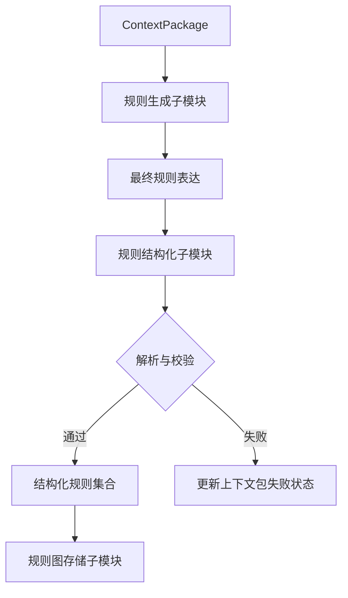

# 规则抽取模块设计

## 一、功能定位

规则抽取（Rule Extraction）模块位于上下文包构建（Context Package Construction）之后、规则检索与推理之前。

其主要任务是：接收完整上下文包，通过模型抽取与反思获得规则表达，再由程序完成结构化、校验和图存储。

```
上下文包构建
→ 规则生成
→ 规则结构化
→ 规则图存储
→ 规则检索与推理
```

### 1.1 输入

模块输入为上下文包（ContextPackage），其中已经包含：

- 主体文本；
- 必要前后文；
- 标题路径；
- 关联图片及说明；
- 关联表格及说明；
- 页码、位置和资源引用。

规则抽取模块直接使用完整上下文包，不重新进行文本切分、上下文召回或资源匹配。

### 1.2 核心输出

模块最重要的输出是校验通过的结构化规则集合（Rule Set）。

每条规则需要明确表达：

- 适用约束；
- 直接前提；
- 结果状态；
- 原文关系；
- 状态转换；
- 来源上下文包。

结构化规则集合是后续图存储、规则检索和参数推理共同使用的核心数据。

### 1.3 辅助结果

上下文包的状态更新、失败原因和后续改进内容属于处理过程记录，不与规则图并列作为主要输出。

处理结果分为两条路径：

```
抽取成功
→ 产生结构化规则集合
→ 写入规则图
→ 更新上下文包为成功
```

```
抽取失败
→ 不产生正式规则
→ 不写入规则图
→ 只更新上下文包状态及失败原因
```

纯操作步骤不进入规则图，记录在所属上下文包的后续改进内容中。

---

## 二、接口方式

### 2.1 上下文包输入接口

规则抽取以单个 `ContextPackage` 作为基本处理对象。

需要使用的数据包括：

|数据|作用|
|---|---|
|上下文包编号|标识规则来源|
|主体文本|提供主要抽取内容|
|必要前后文|恢复跨句条件和指代|
|标题路径|提供讨论主题和范围|
|关联图片|补充图示知识|
|关联表格|补充数值、范围和对比信息|
|来源信息|支持返回原文、页码和资源|

规则通过上下文包编号关联来源，不再为每条规则单独划分句子或字符范围。

### 2.2 模型调用接口

规则生成使用 OpenAI 兼容接口（OpenAI-compatible API）调用本地模型。

主要调用参数包括：

```
model
messages
temperature
max_tokens
```

内部包含两次调用。

第一次调用：

```
规则抽取要求
+ 完整上下文包
→ 规则初稿
```

第二次调用：

```
规则反思要求
+ 完整上下文包
+ 规则初稿
→ 最终规则表达
```

规则初稿只用于第二次模型反思，不作为模块最终输出，也不进入正式数据记录。

### 2.3 最终模型输出接口

反思模型使用约束—规则形式输出最终规则表达：

```
规则组1
C: 对象|状态 + 对象|状态

R: 对象|状态 + 对象|状态
   —[关系词]→ 对象|状态 + 对象|状态
```

其中：

- `C` 表示约束（Condition）；
- `R` 表示规则（Rule）；
- `对象|状态` 表示状态表达（State Expression）；
- `+` 表示同一侧状态共同成立；
- 方括号保存原文明示的关系词。

没有明确约束时写：

```
C: 无
```

示例：

```
规则组1
C: 送丝速度|保持不变 + 焊丝伸出长度|保持不变

R: 电弧电压|降低
   + 熔滴过渡形式|自由过渡
   → 熔滴过渡形式|短路过渡

R: 电弧电压|进一步降低
   —[导致]→ 短路频率|增加
```

### 2.4 规则表达要求

#### 多前提

同一侧由 `+` 连接的状态共同成立：

```
R: 焊接电流|较小
   + 电弧电压|较低
   → 熔滴过渡形式|短路过渡
```

原文表示多个因素分别产生结果时，分别生成规则：

```
R: 电弧电压|过高
   —[可能导致]→ 咬边风险|增加

R: 焊接速度|过快
   —[可能导致]→ 咬边风险|增加
```

#### 多结果

共享相同约束、前提、关系和确定程度的并列结果可以保留在一条规则中：

```
R: 焊接电流|增加
   —[导致]→ 熔深|增加 + 余高|增加
```

如果结果之间存在先后关系，则拆成相邻规则。

#### 状态转换

相同对象同时出现在规则前后且状态不同，表示状态转换（State Transition）：

```
R: 跳弧现象|发生
   + 熔滴过渡形式|射滴过渡
   → 熔滴过渡形式|射流过渡
```

程序由此识别：

```
熔滴过渡形式：
射滴过渡 → 射流过渡
```

#### 规则链

原文表达：

```
A → B → C
```

输出为：

```
R: A → B
R: B → C
```

不直接生成跨步关系 `A → C`。

#### 关系词

无标签箭头表示中性的规则对应关系，不自动解释为因果。

原文明示关系时保留关系词，例如：

```
—[导致]→
—[可能导致]→
—[表明]→
—[伴随]→
—[有利于]→
—[抑制]→
—[随后]→
```

例如：

```
R: 电压变化率|达到临界值
   —[表明]→ 液体小桥|即将断裂
```

#### 数值表达

模型保留原始数值表达，程序只生成便于检索的统一文本：

|原始状态|规范文本|
|---|---|
| `45°～60°` | `45–60 °` |
| `大于2m/s` | `> 2 m/s` |
| `不低于250A` | `≥ 250 A` |
| `小于17V` | `< 17 V` |
| `约4mm` | `≈ 4 mm` |

定性状态和引用型临界状态保持原样：

```
焊接电流|较大
焊接电流|大于射流过渡临界电流
```

### 2.5 结构化规则接口

最终结构化规则（Structured Rule）需要包含：

- 所属上下文包；
- 所属规则组；
- 约束集合；
- 前提集合；
- 结果集合；
- 关系词；
- 状态转换信息；
- 原始规则表达。

程序对数值状态同时保存：

```
原始状态
规范状态文本
```

结构化规则集合是模块向规则图构建传递的核心结果。

---

## 三、总体设计

### 3.1 整体流程

````

````

### 3.2 子模块组成

规则抽取模块由三个核心子模块组成。

|子模块|作用|主要输入|主要输出|
|---|---|---|---|
|规则生成子模块|完成模型抽取与反思|完整上下文包|最终规则表达|
|规则结构化子模块|解析、校验并统一数值文本|最终规则表达|结构化规则集合|
|规则图存储子模块|将结构化规则写入图中|结构化规则集合|规则图|

上下文包状态更新属于贯穿整个流程的管理功能，不单独划分为子模块。

### 3.3 规则生成过程

规则生成子模块内部执行两次模型调用：

```
完整上下文包
→ 第一次抽取
→ 规则初稿
→ 第二次反思
→ 最终规则表达
```

规则初稿只在子模块内部传递。

第二次反思需要重新对照完整上下文，检查：

- 条件遗漏或错误挂载；
- 前提和结果错误；
- 状态转换信息遗漏；
- 数值、范围和临界词遗漏；
- 多前提逻辑错误；
- 并列结果和规则链混淆；
- 关系词与原文不一致；
- 原文未表达关系被错误生成。

### 3.4 规则结构化过程

规则结构化子模块依次完成：

```
读取最终规则表达
→ 解析规则组
→ 解析约束、前提和结果
→ 统一明确数值文本
→ 识别状态转换
→ 执行校验
→ 生成结构化规则集合
```

如果校验失败，则终止当前上下文包处理，不调用模型修复，也不生成正式规则集合。

### 3.5 规则图存储

规则图使用状态表达（State Expression）和规则（Rule）两类核心节点。

关系为：

```
(StateExpression)-[:CONDITION]->(Rule)
(StateExpression)-[:ANTECEDENT]->(Rule)
(Rule)-[:CONSEQUENT]->(StateExpression)
```

规则节点保存：

- 关系词；
- 来源上下文包；
- 原始规则表达。

状态节点保存：

- 对象；
- 原始状态；
- 规范状态文本。

多个约束、多个前提和多个结果通过同一个规则节点连接。

状态转换仍使用普通规则结构表示，不增加独立的图结构。

### 3.6 上下文包状态更新

规则抽取流程需要更新所属 `ContextPackage` 的处理状态。

状态包括：

|状态|含义|
|---|---|
| `pending` |尚未处理|
| `processing` |正在进行规则抽取|
| `success` |已生成并存储正式规则|
| `no_rule` |已完成处理，但没有规则|
| `failed` |模型输出、解析或校验失败|

处理结果与规则图的关系为：

|上下文包状态|是否产生正式规则|是否写入规则图|
|---|---|---|
| `success` |是|是|
| `no_rule` |否|否|
| `failed` |否|否|

操作步骤等后续内容不改变已有规则的成功状态，只附加记录到所属上下文包中。

---

## 四、子模块详解

### 4.1 规则生成子模块（Rule Generator）

#### 作用

利用完整上下文包生成经过反思的最终规则表达。

#### 输入

- 完整上下文包；
- 规则抽取要求；
- 规则反思要求；
- 模型调用参数。

#### 输出

- 最终规则表达。

#### 实现方式

子模块通过 OpenAI 兼容接口调用本地模型两次。第一次生成内部初稿，第二次结合完整上下文进行反思并输出最终结果。

初稿仅用于两次调用之间的数据传递，不向其他子模块输出。

### 4.2 规则结构化子模块（Rule Structurer）

#### 作用

将最终规则表达转换为结构化规则集合，并判断其是否满足正式入图条件。

#### 输入

- 最终规则表达；
- 来源上下文包编号。

#### 输出

校验通过时输出：

- 结构化规则集合；
- 状态转换信息；
- 规范化数值文本。

校验失败时不输出正式规则集合，只返回失败结果供上下文包更新状态。

#### 实现方式

子模块完成：

- 规则组解析；
- 约束、前提和结果解析；
- 关系词提取；
- 简单数值文本统一；
- 状态转换识别；
- 结构完整性校验；
- 重复和明显冲突检查。

该子模块不重新调用模型，也不修复失败规则。

### 4.3 规则图存储子模块（Rule Graph Writer）

#### 作用

将校验通过的结构化规则集合写入正式规则图。

#### 输入

- 结构化规则集合；
- 来源上下文包编号。

#### 输出

- 状态表达节点；
- 规则节点；
- 条件关系；
- 前提关系；
- 结果关系。

#### 实现方式

子模块为约束、前提和结果建立状态表达节点，通过规则节点连接多项输入与输出，并在规则节点中保留关系词、原始表达和来源上下文包。

只有校验通过的规则集合能够进入该子模块。

---

## 五、`ContextPackage` 类属性扩展

上下文包增加规则抽取状态后，需要在现有 `ContextPackage` 类中补充以下属性。

### 5.1 规则抽取状态

记录当前上下文包的规则抽取结果：

```
pending
processing
success
no_rule
failed
```

### 5.2 规则编号列表

记录当前上下文包成功生成的规则编号。

```
成功：包含一个或多个规则编号
无规则：空列表
失败：空列表
```

### 5.3 失败原因

仅在规则抽取失败时记录：

- 模型输出异常；
- 最终表达无法解析；
- 结构校验失败；
- 数值或单位丢失；
- 状态关系明显冲突。

失败原因属于上下文包处理记录，不进入规则图。

### 5.4 后续改进内容

记录当前未进入规则图的内容，例如：

- 操作步骤；
- 复杂流程；
- 暂时无法稳定结构化的断言。

如果上下文包同时成功生成规则，则状态仍为 `success`，后续改进内容作为附加信息保存。

### 5.5 状态更新时机

```
开始处理
→ processing

校验通过并成功写入规则图
→ success

完成抽取但没有规则
→ no_rule

模型、解析或校验失败
→ failed
```

因此，正式核心输出始终是结构化规则集合及其规则图；上下文包状态、失败原因和后续改进内容只负责记录处理结果与未完成内容。